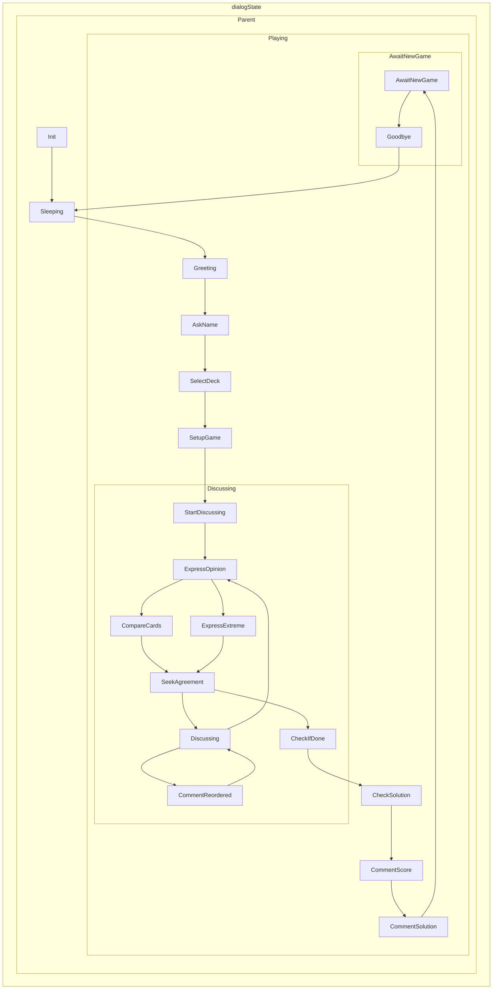

```mermaid
flowchart 
Init-->Sleeping
Sleeping-->Greeting
Greeting-->AskName
AskName-->SelectDeck
SelectDeck-->SetupGame
SetupGame-->StartDiscussing
StartDiscussing-->ExpressOpinion
ExpressOpinion-->CompareCards
CompareCards-->SeekAgreement
SeekAgreement-->Discussing
Discussing-->ExpressOpinion
ExpressOpinion-->ExpressExtreme
ExpressExtreme-->SeekAgreement
Discussing-->CommentReordered
CommentReordered-->Discussing
SeekAgreement-->CheckIfDone
CheckIfDone-->CheckSolution
CheckSolution-->CommentScore
CommentScore-->CommentSolution
CommentSolution-->AwaitNewGame
AwaitNewGame-->Goodbye
Goodbye-->Sleeping
subgraph SdialogState[dialogState]
subgraph SParent[Parent]
Init
subgraph SPlaying[Playing]
Greeting
SelectDeck
SetupGame
CommentScore
subgraph SDiscussing[Discussing]
Discussing
ExpressExtreme
CommentReordered
CompareCards
ExpressOpinion
CheckIfDone
SeekAgreement
StartDiscussing
end
CheckSolution
subgraph SAwaitNewGame[AwaitNewGame]
AwaitNewGame
Goodbye
end
AskName
CommentSolution
end
Sleeping
end
end
```

- dialogState
  - Parent
    - [Init](Init.kt)
